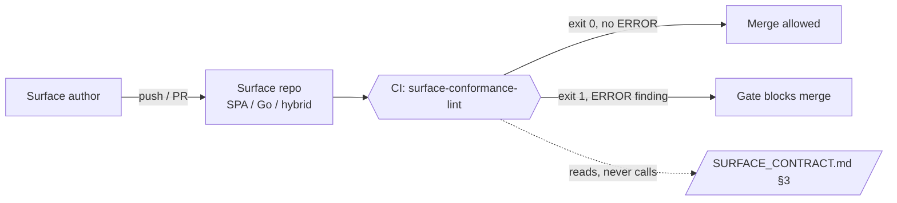

<div align="center">

# surface-conformance

**Static linter that enforces the six SURFACE_CONTRACT.md §3 invariants across a Yggdrasil surface repository.**

[](./LICENSE)
[](./go.mod)

A small, importable Go package **and** a CLI that walks a surface repo and emits warnings or errors for any pattern that breaks the surface contract. · [Usage](./docs/USAGE.md) · [Rules](./docs/RULES.md) · [Development](./docs/DEVELOPMENT.md)

</div>

---

## Where this fits in Yggdrasil

[Yggdrasil](https://github.com/dakasa-yggdrasil/yggdrasil-core) is a self-hosted control plane for declarative workflows + integrations over your whole stack — think *Backstage, but more complete and scalable*. **Surfaces** are the user-facing edge of that plane (UI / API / MCP / bot / hybrid). The contract treats them as *slime* — shape-free — but anchors them with **six invariants** so a surface stays a thin dispatcher and never grows into a second backend.

`surface-conformance` is to surfaces what [`integration-template/pkg/contractcheck`](https://github.com/dakasa-yggdrasil/integration-template/tree/main/pkg/contractcheck) is to integrations: the sibling lint that codifies the contract into a CI gate. It is **tooling** — it ships no runtime, talks to no API, and stores no state. It reads source on disk and prints findings.



The linter is the gate between a surface repo and `main`: an **ERROR** finding (hard-line violation, contract §6) fails CI; a **WARN** finding (strongly discouraged, contract §5) is reported but does not block — it can be allow-listed once an ADR signs off the exception.

---

## What it checks

One row per invariant. Severity, the exact trigger, and the contract clause are derived from `pkg/conformance/checks.go`. Full per-rule detail and fixes live in [docs/RULES.md](./docs/RULES.md).

| # | Invariant id | Checks for | Worst severity | Contract |
|---|---|---|---|---|
| 1 | `stateless` | Surface owns business state: a DB/KV Go import, a persistent-store npm dep, or a non-UX `localStorage`/`IndexedDB` write. | WARN | §3.1, §5.1 |
| 2 | `auth` | Surface reimplements auth: an OIDC/SAML/auth0/Clerk/next-auth library, or a hand-rolled login form / `passport-local`. | ERROR | §3.2, §6.4 |
| 3 | `backend-agnostic` | Surface bypasses core: a direct `fetch`/`axios` to a provider host (Stripe/GitHub/Slack/OpenAI/…) or a non-`/api/v1/*` URL; a cloud SDK import under `surface/`. | ERROR | §3.3, §6.3 |
| 4 | `multi-tenant` | A `/api/v1/*` fetch with no `integration_instance` / `instanceId` scope marker (and not a known read-only core path). | WARN | §3.4 |
| 5 | `lego` | Runtime code or a manifest hardcodes a cloud-specific host (`*.amazonaws.com`, `*.googleapis.com`, `cloudfront.net`, …). Build/CD paths exempt. | WARN | §3.5, §6.3 |
| 6 | `no-business-decisions` | Local control-flow gates a monetary verb (`charge`/`refund`/…) or a hand-rolled `canCharge`-style boolean. Narrow heuristic — manual review still required. | WARN | §3.6, §8 |

> ERROR = exit 1 (blocks the gate). WARN = exit 0 (reported, allow-listable). See [docs/USAGE.md](./docs/USAGE.md#exit-codes) for the severity ladder and exit-code mapping.

---

## Install / Quick start

```bash
# Install the CLI
go install github.com/dakasa-yggdrasil/surface-conformance/cmd/surface-conformance-lint@latest

# Lint a surface checkout
surface-conformance-lint /path/to/surface
#   exit 0, no output    → clean
#   exit 0, WARN lines    → strongly discouraged (contract §5) — allow-listable
#   exit 1, ERROR lines   → hard-line violation (contract §6) — fix before merge
```

Build from source instead:

```bash
git clone https://github.com/dakasa-yggdrasil/surface-conformance
cd surface-conformance
go build ./cmd/surface-conformance-lint
./surface-conformance-lint ./testdata/good-surface   # exits 0, prints nothing
./surface-conformance-lint ./testdata/bad-surface    # exits 1, prints findings
```

Full install/run/CI walkthrough: **[docs/USAGE.md](./docs/USAGE.md)**.

---

## CLI reference

`surface-conformance-lint [flags] <surface-repo-path>` — the path is a directory; the linter walks it and applies the six checks. Source: `cmd/surface-conformance-lint/main.go`.

| Flag | Default | Purpose |
|---|---|---|
| `-format` | `text` | Output format: `text` (human/CI log) or `json` (array of findings). |
| `-skip` | *(none)* | Comma-separated invariant ids to skip: `stateless,auth,backend-agnostic,multi-tenant,lego,no-business-decisions`. |
| `-allow` | *(none)* | Comma-separated glob paths excluded from the scan (e.g. `legacy/**`), on top of the built-in ignores. |
| `-allow-url-prefix` | *(none)* | Extra URL prefixes treated as core-canonical, in addition to the built-in `/api/v1/*` allow-list (rare). |

Exit codes: `0` clean or warnings only · `1` at least one ERROR finding · `2` usage error or unreadable path.

---

## Use as a library

```go
import "github.com/dakasa-yggdrasil/surface-conformance/pkg/conformance"

linter := conformance.NewLinter(conformance.Config{})
findings, err := linter.Lint("/path/to/surface")
if err != nil {
    return err
}
fmt.Println(conformance.FormatText(findings))
os.Exit(conformance.ExitCode(conformance.MaxSeverity(findings)))
```

`Config` accepts `Skip []Invariant`, `AllowPaths []string`, and `AllowedURLPrefixes []string` — the same knobs as the CLI flags. See [docs/DEVELOPMENT.md](./docs/DEVELOPMENT.md) for the package API.

---

## CI wiring (reusable workflow)

Each surface repo calls the reusable workflow shipped here — no per-repo install logic:

```yaml
# <surface-repo>/.github/workflows/surface-conformance.yml
name: Surface Conformance
on:
  push:
    branches: [main]
  pull_request:
permissions:
  contents: read
jobs:
  conformance:
    uses: dakasa-yggdrasil/surface-conformance/.github/workflows/surface-conformance-reusable.yml@main
    with:
      surface-path: "."
```

The workflow checks out the consuming repo, clones the linter into `.surface-conformance/` (auto-excluded from the scan), builds it, and runs it against `surface-path`. Inputs: `surface-path`, `linter-ref`, `allow-paths`, `skip`. Details in [docs/USAGE.md](./docs/USAGE.md#wire-it-into-a-surface-repos-ci).

---

## Fixtures

Two fixtures under `testdata/` double as the test suite and as worked examples:

- `good-surface/` — passes every check; a regression target (exits 0, no output).
- `bad-surface/` — deliberately trips each invariant; verifies at least one finding per invariant and a hard-line ERROR (exits 1).

---

## What this is NOT

- **Not** a replacement for the contract §8 self-test — the `no-business-decisions` invariant still requires manual review.
- **Not** the integration-side lint — [`pkg/contractcheck`](https://github.com/dakasa-yggdrasil/integration-template/tree/main/pkg/contractcheck) is its sibling, one for surfaces, one for integrations.
- **Not** a hard policy enforcer — WARN findings are allow-listable with a documented ADR (contract §5).

---

## Development

Build, test, add a rule, and release: **[docs/DEVELOPMENT.md](./docs/DEVELOPMENT.md)**.

```bash
go vet ./...
go test ./... -count=1
go build ./cmd/surface-conformance-lint
```

Layout: `cmd/surface-conformance-lint/` (CLI) · `pkg/conformance/` (linter package: `conformance.go`, `checks.go`, `walker.go`, `json.go`) · `testdata/` (fixtures) · `.github/workflows/` (CI + reusable workflow).

---

## Compatibility

- Go **1.25** (`go.mod`).
- Zero third-party dependencies — standard library only.
- Enforces **SURFACE_CONTRACT.md §3** as published by [surface-template](https://github.com/dakasa-yggdrasil/surface-template/blob/main/SURFACE_CONTRACT.md).

## Related

- Surface contract: <https://github.com/dakasa-yggdrasil/surface-template/blob/main/SURFACE_CONTRACT.md>
- Integration contract: <https://github.com/dakasa-yggdrasil/integration-template/blob/main/INTEGRATION_CONTRACT.md>
- Integration-side lint (mirror pattern): <https://github.com/dakasa-yggdrasil/integration-template/tree/main/pkg/contractcheck>
- Control plane: <https://github.com/dakasa-yggdrasil/yggdrasil-core>

## License

Apache-2.0 — see [LICENSE](./LICENSE).

<sub>Last updated 2026-06-01.</sub>
