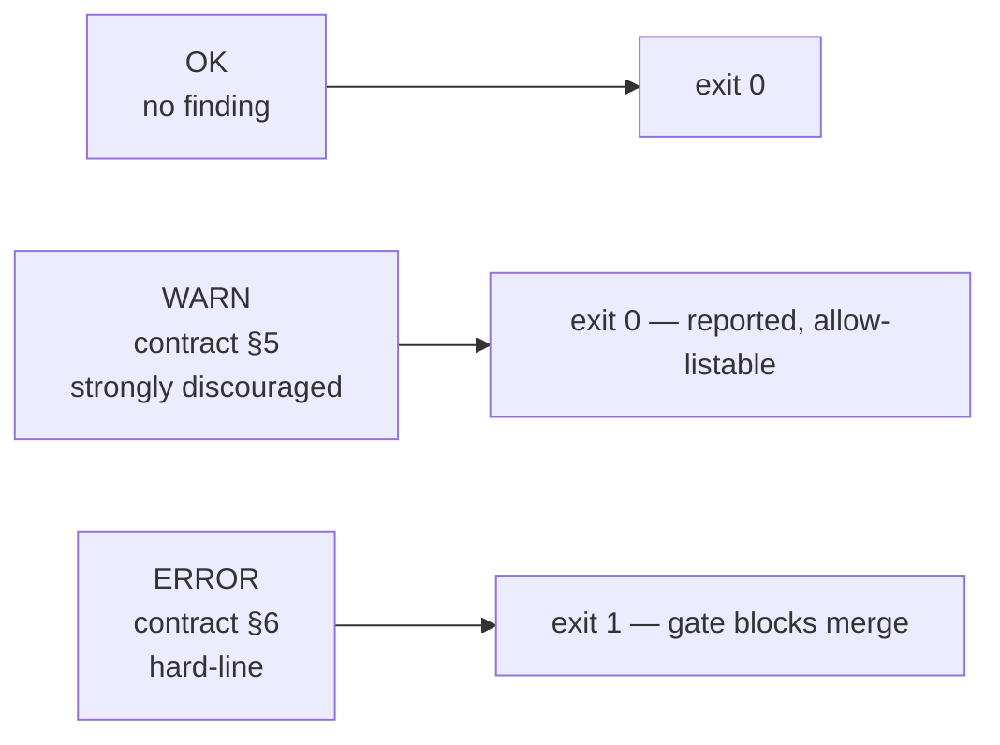
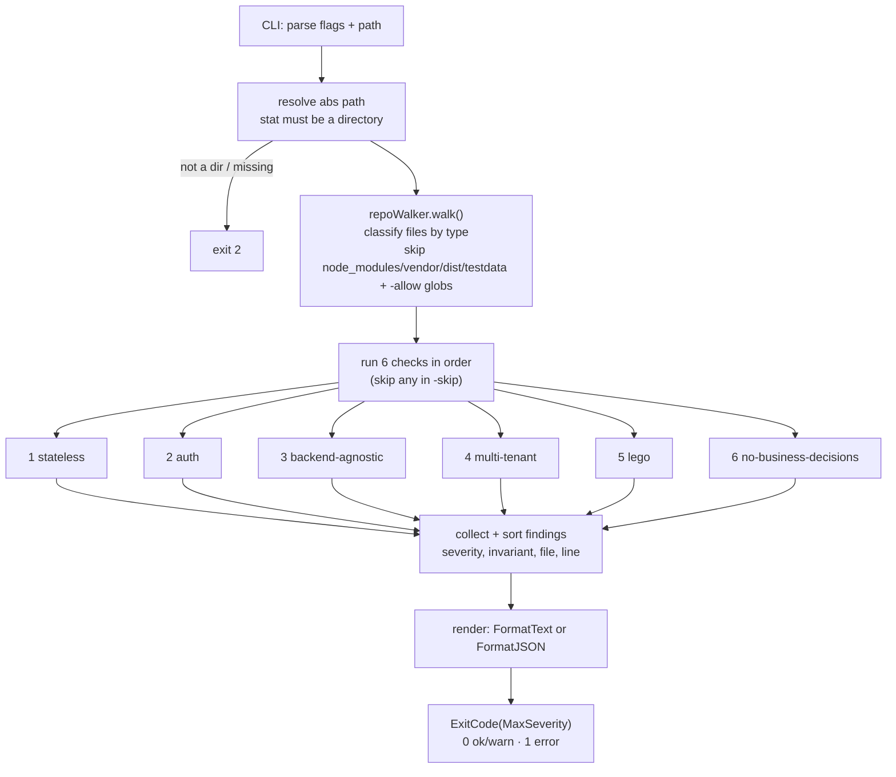
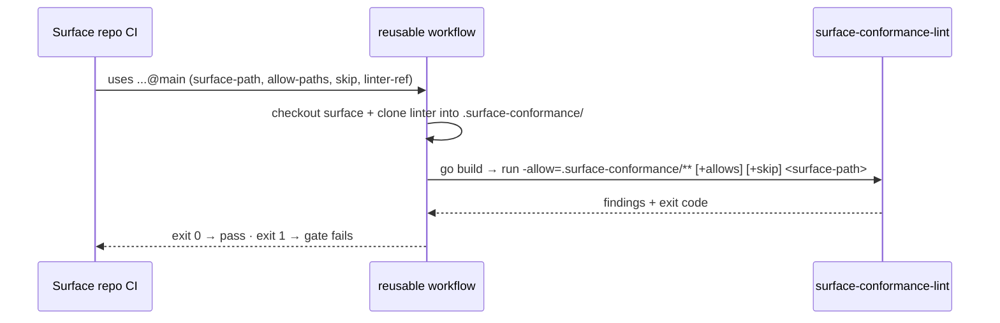

# Usage

End-to-end: install the linter, run it against a surface checkout, read the output, understand the exit codes, and wire it into a surface repo's CI gate.

Back to the [README](../README.md) · rule catalog in [RULES.md](./RULES.md) · contributing in [DEVELOPMENT.md](./DEVELOPMENT.md).

---

## What it lints

`surface-conformance` walks a **surface repository** (a directory on disk) and applies six static checks, one per [SURFACE_CONTRACT.md §3](https://github.com/dakasa-yggdrasil/surface-template/blob/main/SURFACE_CONTRACT.md) invariant. It needs nothing but the source tree — no running core, no manifest registration, no network. It inspects:

- Go files (`*.go`, excluding `*_test.go`)
- TypeScript / JavaScript (`*.ts`, `*.tsx`, `*.js`, `*.jsx`, `*.mjs`, `*.cjs`, excluding `*.test.*` / `*.spec.*`)
- `package.json` and `*.config.json`
- `surface.manifest.json` and `*.manifest.yaml` / `*.manifest.yml`

It always skips `node_modules/`, `vendor/`, `dist/`, `build/`, `.git/`, minified assets, and `testdata/` — plus anything matched by `-allow`.

---

## Install

```bash
go install github.com/dakasa-yggdrasil/surface-conformance/cmd/surface-conformance-lint@latest
```

Or build from a clone:

```bash
git clone https://github.com/dakasa-yggdrasil/surface-conformance
cd surface-conformance
go build ./cmd/surface-conformance-lint
```

Requires Go **1.25** (`go.mod`). No third-party dependencies.

---

## Run against a surface

```bash
surface-conformance-lint /path/to/surface
```

Try the bundled fixtures to see both outcomes:

```bash
# Clean surface — exits 0, prints nothing
surface-conformance-lint ./testdata/good-surface

# Violating surface — exits 1, prints findings
surface-conformance-lint ./testdata/bad-surface
```

### Flags

| Flag | Default | Purpose |
|---|---|---|
| `-format` | `text` | `text` (human-readable, for CI logs) or `json` (machine-readable array). |
| `-skip` | *(none)* | Comma-separated invariant ids not to run. Valid ids: `stateless`, `auth`, `backend-agnostic`, `multi-tenant`, `lego`, `no-business-decisions`. |
| `-allow` | *(none)* | Comma-separated glob paths excluded from the scan, on top of the built-in ignores. Globs support `*` (one segment) and `**/` (any depth) — e.g. `legacy/**,generated/*.ts`. |
| `-allow-url-prefix` | *(none)* | Extra URL prefixes treated as core-canonical, alongside the built-in `/api/v1/*` allow-list. Use sparingly. |

Examples:

```bash
# JSON for tooling
surface-conformance-lint -format=json /path/to/surface

# Skip the manual-review-heavy invariant, exempt a vendored dir
surface-conformance-lint -skip=no-business-decisions -allow="legacy/**" /path/to/surface

# Treat a v2 API as core-canonical for the backend-agnostic check
surface-conformance-lint -allow-url-prefix=/api/v2/ /path/to/surface
```

---

## Read the output

### Text format

Findings are sorted by severity (errors first), then invariant, file, and line. Each finding shows the icon + invariant + message, the file:line, and a suggestion:

```text
[ERROR] backend-agnostic — surface calls upstream provider directly: "https://api.stripe.com/v1/charges" — hard-line violation (SURFACE_CONTRACT.md §3.3 + §6.3)
  file: src/App.tsx:6
  suggestion: Route the call through yggdrasil-core (`/api/v1/integrations/{instanceId}/surface-query` or a workflow dispatch). See surface-toolkit useSurfaceQuery.

[WARN] stateless — surface package.json declares persistent-store dependency "prisma" — surfaces are stateless w.r.t. business state (SURFACE_CONTRACT.md §3.1)
  file: package.json:8
  suggestion: Remove the dependency and call yggdrasil-core /api/v1/* + integrations instead. If genuinely UX-only, document the ADR per §5.1.
```

A clean surface prints **nothing** in text mode.

After the findings, the CLI writes one summary line to **stderr**:

- warnings only → `warnings only (exit 0); see SURFACE_CONTRACT.md §5 for exception path`
- any error → `hard-line violation(s) — SURFACE_CONTRACT.md §6`

### JSON format

`-format=json` prints an array of finding objects (always valid JSON — `[]` when clean). `severity` renders as the string `WARN` / `ERROR`, never an int:

```json
[
  {
    "invariant": "backend-agnostic",
    "severity": "ERROR",
    "file": "src/App.tsx",
    "line": 6,
    "message": "surface calls upstream provider directly: \"https://api.stripe.com/v1/charges\" — hard-line violation (SURFACE_CONTRACT.md §3.3 + §6.3)",
    "suggestion": "Route the call through yggdrasil-core (`/api/v1/integrations/{instanceId}/surface-query` or a workflow dispatch). See surface-toolkit useSurfaceQuery."
  }
]
```

`line` is omitted when zero; `suggestion` is omitted when empty.

---

## Exit codes

The exit code maps the **highest** severity in the run (`MaxSeverity` → `ExitCode`):

| Code | Meaning | When |
|---|---|---|
| `0` | Pass | No findings, **or** WARN-only findings (strongly discouraged, contract §5 — still allow-listable). |
| `1` | Fail (gate blocks) | At least one **ERROR** finding (hard-line violation, contract §6). |
| `2` | Usage / IO error | No path argument, or the path is missing / not a directory. |

The severity ladder (`pkg/conformance/conformance.go`):



A WARN does not fail CI. The intent is that the team either fixes it or, when the pattern is genuinely justified, writes an ADR per contract §5 and adds the path to `-allow`.

---

## The check pipeline

What happens between `surface-conformance-lint <path>` and the exit code:



---

## Wire it into a surface repo's CI

Surfaces consume the **reusable workflow** published in this repo (`.github/workflows/surface-conformance-reusable.yml`) — no per-repo install or version pinning of the binary. Add this to the surface repo:

```yaml
# <surface-repo>/.github/workflows/surface-conformance.yml
name: Surface Conformance
on:
  push:
    branches: [main]
  pull_request:
permissions:
  contents: read
jobs:
  conformance:
    uses: dakasa-yggdrasil/surface-conformance/.github/workflows/surface-conformance-reusable.yml@main
    with:
      surface-path: "."
```

### What the reusable workflow does

1. Checks out the consuming surface repo.
2. Checks out `surface-conformance` into a `.surface-conformance/` subdirectory of the consuming checkout (`actions/checkout` refuses paths outside the workspace).
3. Sets up Go from `.surface-conformance/go.mod`.
4. Builds the linter to `$RUNNER_TEMP/surface-conformance-lint`.
5. Runs it against `surface-path`, **always** passing `-allow=.surface-conformance/**` so the linter never scans its own cloned source, plus any caller `allow-paths`, plus any caller `skip`.



### Reusable workflow inputs

| Input | Required | Default | Meaning |
|---|---|---|---|
| `surface-path` | no | `"."` | Path to the surface root inside the consuming repo. |
| `linter-ref` | no | `"main"` | git ref of `dakasa-yggdrasil/surface-conformance` to install (pin for reproducibility). |
| `allow-paths` | no | `""` | Comma-separated globs to exempt, appended after the always-on `.surface-conformance/**`. |
| `skip` | no | `""` | Comma-separated invariant ids to skip — rare; document why in the PR. |

### Without the reusable workflow

If you prefer to invoke the CLI directly in a surface repo's pipeline:

```yaml
- uses: actions/setup-go@v5
  with: { go-version: '1.25' }
- run: go install github.com/dakasa-yggdrasil/surface-conformance/cmd/surface-conformance-lint@latest
- run: surface-conformance-lint -allow="legacy/**" .
```

The CLI's non-zero exit on an ERROR finding fails the step — that is the gate.

---

## Troubleshooting

| Symptom | Cause | Fix |
|---|---|---|
| `exit 2`, `surface path is not a directory` | Passed a file, or the path does not exist. | Point at the surface repo root directory. |
| `exit 2`, usage printed | No path argument supplied. | `surface-conformance-lint <path>` — path is required. |
| Finding inside vendored / generated code | Path not excluded. | Add it to `-allow` (CLI) or `allow-paths` (workflow), e.g. `-allow="generated/**"`. |
| WARN you can justify (ADR exists) | Pattern is intentional per contract §5. | Add the path to `-allow`, or `-skip` the invariant repo-wide (document the why). |
| A `/api/v1/*` call flagged `multi-tenant` but is genuinely tenant-aware upstream | Path not in the read-only exempt list. | Route through `useSurfaceQuery`/`useInstance`, or include `instanceId`/`integration_instance` in the call — see [RULES.md](./RULES.md). |
